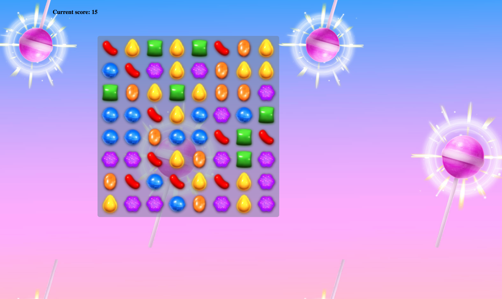

# Candy Cubes - Simplified version of Candy Crush built with JS

A vanilla JavaScript Game inspired by Candy Crush - Built for learning purposes.

Screenshot of application:

Live link, [here](https://nard1n.github.io/candy-cubes)

## Table of Contents

* [Installation](#Installation)
* [Usage](#Usage)
* [Contributing](#Contributing)
* [Tests](#Tests)
* [License](#License)
* [Questions](#Questions)

## Installation
Feel free to clone the repo or reference the code and simply run it in your browser

## Usage
Great for practicing inbuilt Javascript methods (drag and drop elements, addEventListener, setAttribute, setInterval, some, every, forEach, includes, contains, add, remove, createElement, appendChild, push, continue, etc)

## Contributing
We love seeing community contribution to any opensource project! If you would like to add anything, please do.

## Tests
n/a
## License
This project is released under MIT opensource license:

https://opensource.org/licenses/MIT

## Questions
For more about my work, check out my Github profile: https://github.com/nard1n

If you have any questions and would like to chat, please feel free to send me an email directly to nardincodes@gmail.com